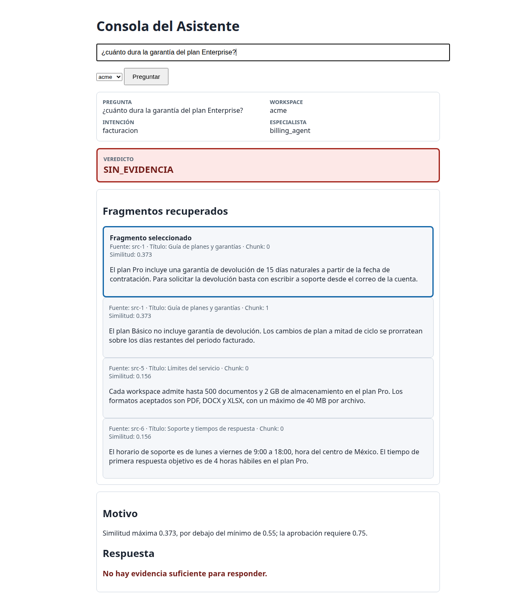

# Notas de entrega — Jeronimo Novoa Giraldo

## Resumen

- Estado general: **COMPLETO**. Se completaron los seis ejercicios, el verificador, la auditoría, la prueba desde un clon nuevo y la captura obligatoria desde la consola final real.
- Completado: `classify_intent()`, `count_messages_by_intent()`, la recuperación aislada con registro de correcciones, el verificador v2 no reescritor, `LoopGuard`, la orquestación asíncrona y la interfaz segura de evidencia.
- Evidencia final: `evidence/enterprise-abstention.png`, capturada con Chromium instalado localmente desde la página servida por `app.py`.
- Motivo: la entrega se construye en cortes autónomos para preservar evidencia y facilitar la revisión.

## Tiempo

| Dato | Estado |
|---|---|
| Inicio | 24/09/2026 14:00 |
| Entrega final | Pendiente de la verificación final FDC-3; se registrará con la hora local observada, sin inferir zona horaria. |
| Ejercicio 1 | 1.2 h estimadas por la persona candidata. |
| Ejercicio 2 | 1.4 h estimadas por la persona candidata. |
| Ejercicio 3 | 1.7 h estimadas por la persona candidata. |
| Ejercicio 4 | 1.5 h estimadas por la persona candidata. |
| Ejercicio 5 | 1.8 h estimadas por la persona candidata. |
| Ejercicio 6 | 2.0 h estimadas por la persona candidata. |
| Total | 9.6 h estimadas; no son mediciones instrumentadas. |

## Decisiones

### Alta confianza

1. Normalizar el texto elegible una sola vez con NFKD y eliminar marcas combinantes. Revertiría esta decisión si pruebas con idiomas donde las marcas cambian el significado mostraran colisiones de intención.
2. Excluir líneas citadas antes de normalizar. Revertiría esta decisión si conversaciones reales demostraran, mediante casos etiquetados, que la cita es contexto imprescindible y no una fuente de falsos positivos.
3. Reemplazar el resultado solo ante un patrón estrictamente más largo. Revertiría esta decisión si un conjunto de evaluación mostrara que prioridad explícita o frecuencia reduce errores frente a longitud y orden de catálogo.

### Baja confianza

1. Mantener `workspace_id` como metadato porque el recuperador protegido no permite filtrar. Lo revertiría cuando exista una API autorizada con filtro por workspace y pruebas que demuestren aislamiento entre clientes.
2. Omitir respuestas con fuente inválida y registrarlas en el ledger sin ampliar el esquema. Lo revertiría si consumidores reales necesitaran cardinalidad estable y existiera una versión de contrato que admita un estado explícito de indisponibilidad.

## Ejercicio 1 — reglas vs LLM

Las reglas ofrecen resultados deterministas, rápidos y auditables: ante el mismo catálogo y mensaje siempre producen la misma intención, sin costo de inferencia ni dependencia externa. Su desventaja es que la cobertura depende de frases previstas; variaciones semánticas no representadas pueden quedar como desconocidas. Cambiaría a un clasificador entrenado o a un LLM cuando los mensajes reales mostraran una tasa sostenida de desconocidos o errores por paráfrasis que hiciera inmantenible ampliar el catálogo. Antes del cambio mediría esa tasa con el reporte de cobertura y conservaría un conjunto de evaluación, límites de confianza y una salida desconocida para evitar convertir mayor cobertura en decisiones opacas e inseguras.

## Ejercicio 3 — tabla de defectos

| # | Línea | Qué está mal | Síntoma en producción | Gravedad |
|---|---|---|---|---|
| 1 | Firma original, `cache={}` | El valor mutable se crea una vez y queda compartido por todas las invocaciones del proceso. | Una consulta reutiliza estado de otra solicitud del mismo workspace; además retiene datos indefinidamente y distintos procesos o reinicios producen respuestas inconsistentes. | Crítica |
| 2 | Lectura original `cache[workspace_id]` | La clave de caché omite `min_similitud`. | La primera consulta fija el conjunto: una llamada posterior con otro umbral recibe respuestas que debería excluir o pierde respuestas que debería incluir. | Crítica |
| 3 | Retorno original `return cache[workspace_id]` y asignación `cache[workspace_id] = result` | La lista y sus diccionarios se entregan y almacenan por referencia, sin copia defensiva. | Si un llamante elimina o modifica una respuesta, los siguientes llamantes observan esa mutación. | Crítica |
| 4 | Construcción original `db = DatabaseClient()` | Ignora `get_db_client()` y crea un cliente directo por ejecución. | En producción multiplica conexiones e inicializaciones y rompe el ciclo de vida singleton previsto por los adaptadores. | Alta |
| 5 | Bucle original `await db.table("sources").item(...).get()` | Ejecuta una consulta de fuente secuencial por respuesta, incluso para fuentes repetidas. | La latencia y la carga del almacén crecen linealmente con las respuestas: patrón N+1 sin paralelismo ni agrupación. | Alta |
| 6 | Bucle original, lectura de fuente antes de `if data["similitud"] >= min_similitud` | Filtra demasiado tarde: resuelve la fuente antes de decidir si la respuesta es elegible. | Respuestas bajo el umbral generan I/O inútil; una referencia inválida bajo el umbral puede abortar una solicitud que debía ignorarla. | Media |
| 7 | Escritura original `Path("/tmp/last_answers.json").write_text(...)` | Usa un archivo global compartido como efecto lateral de cada consulta. | Solicitudes concurrentes se pisan y exponen respuestas de un workspace a otros usuarios o procesos del host; un filesystem efímero o de solo lectura rompe la llamada. | Crítica |
| 8 | Accesos originales `item(...).get()` y `source.to_dict()["titulo"]` sin manejo local | Una fuente ausente, malformada o sin título lanza una excepción y no conserva evidencia del defecto. | Una sola referencia inválida aborta todas las respuestas válidas del workspace y deja el incidente sin registro durable para corregirlo. | Alta |

La implementación elimina el caché y la salida temporal, obtiene respuestas y fuentes una vez por solicitud, aplica el umbral inclusivo antes de leer fuentes y devuelve diccionarios nuevos. Las respuestas con fuente inválida se omiten; el registro pendiente conserva identificadores y motivo sin ampliar el esquema devuelto ni modificar datos protegidos.

## Ejercicio 4 — qué movería a código determinista

Movería a código determinista la validación del esquema, la pertenencia de la fuente, la comparación literal de la cita, la presencia y coincidencia del chunk, los límites numéricos y la precedencia del veredicto. Son reglas cerradas, auditables y sensibles a valores exactos; un LLM puede variarlas o aceptar paráfrasis plausibles. Reservaría el LLM para explicar en lenguaje natural un resultado ya calculado, nunca para alterar los booleanos ni reescribir la respuesta. Incluso esa explicación quedaría restringida a los hechos observados. Así, el mismo JSON produce siempre el mismo veredicto y casos como una fuente inexistente, una cita no literal o una similitud exactamente igual a `0.55` no dependen del juicio probabilístico del modelo.

## Ejercicio 6 — cómo mejoraría el recuperador

Cambiaría la comparación léxica por recuperación semántica con embeddings: representaría preguntas y fragmentos como vectores y buscaría por cercanía, de modo que “restablecer contraseña” y “recuperar acceso” puedan coincidir aunque no compartan palabras. Mantendría un índice léxico como señal complementaria para términos exactos, nombres de planes y cifras. El costo es mayor complejidad operativa: generar y versionar embeddings, reconstruir el índice cuando cambia el contenido, medir latencia y pagar cómputo o un servicio externo. También exigiría un conjunto de evaluación por cliente para ajustar umbrales y comprobar que la mejora semántica no recupera fragmentos plausibles pero incorrectos.

## Ejercicio 5 — dónde enchufo la guardia

Enchufaría la guardia inmediatamente antes de ejecutar cada herramienta, después de resolver la sesión y el agente que solicita la llamada. `record(session_id, agent_name)` decide de forma atómica si la ejecución puede continuar; si supera el límite, se propaga `ToolLoopError` y la herramienta no se invoca. El bloqueo protege únicamente la lectura y actualización del contador, nunca la llamada externa, para no serializar trabajo independiente. Al terminar una sesión, su bloque `finally` llama a `reset(session_id)` aunque la consulta falle. Usaría `snapshot(session_id)` para adjuntar conteos a logs o métricas antes del reset, sin exponer el diccionario interno. El límite debería configurarse por política operativa, manteniendo la clave compuesta para que agentes y sesiones no se interfieran.

## Uso de IA

Se utilizó OpenCode con el asistente OpenAI GPT-5.6 Sol en los seis ejercicios para análisis del repositorio, planificación SDD, apoyo de implementación, diseño y ejecución de pruebas, depuración y documentación. La persona candidata dirigió los requisitos y aprobó las decisiones. La aplicación no llama a una API de IA.

## Evidencia de verificación

- Estado actual posterior a la corrección tipográfica: suite completa **61/61** en 0.14 s; la pregunta `reestablezco` produce `DUDOSO` con similitud **0.566**.
- Recolección inicial: 21 pruebas detectadas.
- RED inicial del clasificador: 18 fallos por `NotImplementedError`.
- GREEN del clasificador: 18 pruebas aprobadas.
- Suite completa posterior: 18 aprobadas y 3 fallidas. Los fallos restantes corresponden a `consultar()` (2) y `count_messages_by_intent()` (1), todavía no implementados.
- Integridad posterior: todos los hashes protegidos coinciden; el literal fuente y el hash canónico de `INTENTS` coinciden con la línea base.
- RED del reporte: 8 fallos en 0.08 s antes de implementar el comportamiento.
- GREEN del reporte: 8 pruebas aprobadas en 0.05 s; la suite completa quedó en 26 aprobadas y 2 fallidas por `consultar()`, fuera de este corte.
- RED de `consultar()`: 9 fallos en 0.11 s antes de implementar el núcleo.
- GREEN de `consultar()`: 9 pruebas aprobadas en 0.04 s; regresiones de clasificador y reporte aprobadas, y suite completa 35/35 en 0.08 s.
- Smoke HTTP del corte: `/api/consulta` devolvió 200, las 8 claves exactas, 4 fragmentos, `APROBADO` y la respuesta literal del fragmento con mayor similitud.
- RED de interfaz segura: 3 fallos esperados antes de reemplazar el volcado JSON.
- GREEN de interfaz: 12/12 pruebas de `test_app.py`; regresiones de clasificador 18/18 y reporte 8/8; suite completa 38/38.
- Demostración HTTP real: Pro → `APROBADO` (1.0), contraseña → `DUDOSO` (0.566), Enterprise → `SIN_EVIDENCIA` (0.373, respuesta nula); cuatro fragmentos en cada caso.
- Prueba hostil HTTP: pregunta con `` y `<script>` y workspace con `<script>` conservaron el texto exacto en JSON; la página usa `createElement`/`textContent`, no contiene `innerHTML` y codifica ambos parámetros.
- Limitación histórica del corte 4: no había navegador disponible entonces; la captura final se completó posteriormente en el corte 8 con Chromium autorizado.
- RED de recuperación heredada: 11 casos ejecutados contra el código original; 9 fallaron y 2 pasaron en 0.15 s. Los fallos expusieron contaminación por caché, pérdida de propiedad, lecturas de fuente y ausencia del ledger; los dos pases iniciales motivaron reforzar los escenarios de singleton y salida temporal antes de GREEN.
- Efecto lateral durante ese RED: la implementación heredada creó `/tmp/last_answers.json`. Su contenido no se leyó. Con autorización específica, el proceso padre eliminó ese archivo y verificó su ausencia; esta recuperación no autoriza acceso a otras rutas externas.
- GREEN del corte 5: 11/11 pruebas de ledger y recuperación aprobaron en 0.06 s. El ledger predeterminado registró el defecto real `a-4`/`src-99-inexistente` como `missing_source`; dos respuestas válidas de `acme` se conservaron.
- Verificador v2: los 2 ejemplos JSON se parsearon con claves cerradas; la matriz derivada directamente de la fixture fue `a-1` APROBADO, `a-2`/`a-3`/`a-4` RECHAZADO y `a-5` DUDOSO.
- Regresión del corte 6: suite completa 49/49 en 0.10 s; 7/7 hashes protegidos, `INTENTS`, dependencias, v1 y el informe histórico permanecieron sin cambios.
- RED de `LoopGuard`: 7/7 pruebas fallaron en 0.05 s ante el `NotImplementedError` suministrado.
- GREEN de `LoopGuard`: 7/7 pruebas aprobaron en 0.03 s; la prueba concurrente de 1000 llamadas aprobó 10 ejecuciones consecutivas sin perder incrementos.
- Regresión del corte 7: suite completa 56/56 en 0.12 s.
- Verificador final: 4/4 pruebas enfocadas; hashes protegidos, `INTENTS` y dependencias coinciden. El ledger conserva un pendiente válido: `acme`/`a-4`/`src-99-inexistente`, `missing_source`; no autoriza corrección.
- Árbol principal: suite completa 60/60 en 0.13 s; `python -m tools.verify_delivery` terminó con código 0.
- Evidencia histórica anterior a la corrección tipográfica, clon local limpio de `3098b69fccfb3970581e7945b2b1d13136e77584`: 60/60 en 0.14 s; verificador con código 0; página HTTP 200 (4532 bytes); Pro `APROBADO` 1.0, contraseña `DUDOSO` 0.666 y Enterprise `SIN_EVIDENCIA` 0.373 con respuesta nula. El resultado vigente posterior a esa corrección es 61/61 y `0.566` para `reestablezco`.
- Captura final: Chromium `153.0.8010.47` cargó `http://127.0.0.1:8000/`, envió la pregunta Enterprise mediante el formulario real y produjo `evidence/enterprise-abstention.png`. La inspección DOM confirmó la pregunta, `SIN_EVIDENCIA` y `No hay evidencia suficiente para responder.` visibles; PNG de 146354 bytes, 1265×1452, SHA-256 `f88e87efd9af0169b0217276beea7216d0773f3bd8c78de3afafc51a476d8241`.

## Captura de abstención Enterprise

Capturada el 25/09/2026 a las 11:43:00 -05:00 desde `app.py` en `127.0.0.1:8000` con Chromium `153.0.8010.47` headless y Chrome DevTools Protocol. La página real mostró la pregunta `¿cuánto dura la garantía del plan Enterprise?`, el veredicto `SIN_EVIDENCIA` y la abstención explícita `No hay evidencia suficiente para responder.`. El perfil, el script, el log y el estado temporal del servidor se eliminaron después de la captura.

## Qué haría con una semana más

Automatizaría el smoke visual con una prueba mantenible, añadiría un conjunto etiquetado de paráfrasis para medir recuperación semántica, revisaría semanalmente desconocidos y DUDOSO, y propondría una corrección de `a-4` solo con autorización explícita y una fuente válida verificable.

## Registro por cortes

### Corte 1 — clasificador y procedencia

- Se creó una línea base Git separada antes de editar código fuente.
- Se registraron hashes SHA-256 de los archivos protegidos y del literal canónico `INTENTS`.
- La normalización elimina citas, descompone Unicode, elimina marcas, convierte signos en espacios y colapsa separadores.
- La coincidencia usa límites de token, selecciona el patrón más largo y conserva el orden del catálogo en empates.
- Estado de pruebas: 18/18 pruebas enfocadas aprobadas; la suite completa conserva 3 fallos esperados por ejercicios todavía pendientes.
- Tamaño authored del corte funcional: 143 líneas añadidas o eliminadas, sin contar los artefactos OpenSpec de progreso.

### Corte 2 — reporte de cobertura por intención

- Se reutilizan exclusivamente `get_db_client()` y `get_storage_client()`; dos reportes consecutivos mantienen una sola instancia de cada cliente.
- Un workspace inexistente conserva el `KeyError` del almacenamiento porque no equivale a un workspace existente sin mensajes.
- Los resultados inactivos o no registrados se acumulan en `desconocido`; así, la suma siempre coincide con los mensajes recuperados.
- Los errores operativos se propagan y registran solo la operación y el workspace, sin cuerpos de mensajes, credenciales ni texto de la excepción.
- Evidencia temporal del runner: RED 8 fallos en 0.08 s; GREEN 8 aprobadas en 0.05 s. En ese corte todavía no se habían consolidado las horas; la estimación final figura en la tabla de tiempo.

### Corte 3 — núcleo asíncrono de consulta

- `workspace_id` se devuelve como metadato de la solicitud; no filtra el recuperador protegido, cuya API global se conserva sin cambios.
- Todos los fragmentos se copian y mantienen en el orden recuperado; el veredicto y la respuesta usan el máximo real aunque la entrada no esté ordenada.
- Los límites se comparan sin redondear: menos de `0.55` abstiene, desde `0.55` hasta menos de `0.75` es `DUDOSO`, y desde `0.75` es `APROBADO`.
- Cada motivo expone el valor observado o la ausencia de fragmentos y los umbrales aplicables; la respuesta aprobada o dudosa conserva exactamente el texto superior.
- La interfaz existente no se modificó: el renderizado seguro y la demostración visual pertenecen al corte 4.

### Corte 4 — consola segura y legible

- La página crea nodos DOM y asigna pregunta, workspace, intención, especialista, fuentes, títulos, chunks, textos, puntajes, motivo y respuesta mediante `textContent`; ningún dato de respuesta se interpola como HTML.
- Pregunta y workspace se envían con `encodeURIComponent`. Los tres veredictos tienen estilos inequívocos, el fragmento con mayor puntaje queda marcado y la respuesta nula muestra una abstención explícita.
- El servidor local devolvió los tres resultados exigidos: Pro `APROBADO` con 1.0, contraseña `DUDOSO` con 0.566 y Enterprise `SIN_EVIDENCIA` con 0.373 y respuesta nula.
- La prueba hostil preservó literalmente sintaxis `` y `<script>` en la API sin insertarla en la plantilla. No había motor de navegador para ejecutar el DOM; la evidencia combina el contrato automatizado y HTTP real.
- En este corte no se tomó la captura Enterprise; la evidencia real se completó posteriormente en el corte 8.

### Corte 5 — recuperación heredada y ledger pendiente

- El trabajo se dividió una sola vez: 5a contiene la infraestructura JSONL y sus pruebas; 5b integra la recuperación y sus pruebas para mantener unidades revisables.
- `get_workspace_answers()` reutiliza el singleton, consulta respuestas una vez, retorna temprano sin leer fuentes cuando no hay elegibles y carga la tabla de fuentes una sola vez para indexarla por identificador.
- Cada resultado y diccionario enriquecido es nuevo. El umbral es inclusivo y `confianza` conserva el contrato existente (`alta` solo cuando la similitud es mayor que `0.8`).
- Una fuente ausente, malformada o sin título genera log y registro durable con motivo distinto; la respuesta afectada se omite y las respuestas válidas conservan su esquema y disponibilidad.
- El ledger UTF-8 JSONL usa deduplicación estable, bloqueo de hilo, `flush`/`fsync`, estado `pending` y tiempo UTC. Un archivo ausente o vacío equivale a cero pendientes; sintaxis malformada falla explícitamente.
- El registro predeterminado contiene un defecto real de la fixture: respuesta `a-4`, fuente `src-99-inexistente`, motivo `missing_source`. Permanece pendiente y **no autoriza** corregir fuentes, fixtures ni datos.
- El RED inicial ejecutado contra la implementación heredada creó accidentalmente `/tmp/last_answers.json`; no se leyó su contenido. El proceso padre, con autorización específica para esa ruta, lo eliminó y verificó su ausencia. Las pruebas finales inspeccionan e interceptan el intento mediante mock, usan directorios temporales locales explícitos y no vuelven a sondear esa ruta real.

### Corte 6 — verificador v2 y matriz de fixtures

- El contrato exige respuesta, cita, fuente, chunk, similitud y evidencia autoritativa; devuelve solo el veredicto JSON cerrado y nunca una respuesta reescrita.
- La cita debe ser una subcadena literal, sin normalización ni aceptación de paráfrasis. Por eso `a-3` es `RECHAZADO` aunque use `src-2` y tenga similitud `0.88`.
- La precedencia rechaza primero fuentes inválidas y citas no literales. Evidencia válida desde `0.55` hasta menos de `0.75`, o evidencia real sin chunk, queda `DUDOSO`; desde `0.75` solo se aprueba si todos los controles pasan.
- La matriz queda: `a-1` APROBADO; `a-2`, `a-3` y `a-4` RECHAZADO; `a-5` DUDOSO. Las fixtures permanecen intactas.

### Corte 7 — guardia contra bucles

- Los conteos usan la clave `(session_id, agent_name)`, por lo que agentes de una sesión y nombres idénticos entre sesiones permanecen aislados.
- Un único `threading.Lock` protege cada transición compartida. El intento posterior al límite falla con sesión, agente, conteo intentado y límite, sin incrementar el valor almacenado.
- `reset()` elimina solo las claves de la sesión solicitada y acepta sesiones desconocidas; `snapshot()` crea una copia dentro del bloqueo y la devuelve después de liberarlo.
- La prueba concurrente ejecuta 1000 llamadas sobre una misma clave con límite suficiente y exige todos los conteos del 1 al 1000, además del valor final exacto.

### Corte 8 — auditoría final

- El verificador es de solo lectura, usa únicamente la biblioteca estándar y diferencia fallos de línea base, integridad y ledger mediante códigos de salida deterministas.
- Las pruebas cubren éxito, divergencia protegida, JSONL malformado y registro pendiente válido sin convertirlo en fallo.
- La auditoría y el clon limpio confirmaron código, dependencias, ledger y los tres resultados HTTP; el clon se eliminó después de recopilar la evidencia.
- Chromium local ejecutó la página real, el DOM probó pregunta/veredicto/abstención y la captura PNG validada quedó registrada sin modificar código, fixtures ni dependencias.
